# IR SENSORS
### _What is meant by IR?_ 
<br/>
<p style='text-align: justify;'> IR stands for Infrared Radiation, is an Electro-Magnetic Radiation (EMR) with wavelengths longer than those of visible light. Discovered in 1800 by astronomer Sir William Herschel, IR is a region of the electromagnetic radiation spectrum where wavelengths range from about 700 nanometers (nm) to 1 millimeter (mm). They are longer than those of visible light, but shorter than those of radio waves. As they do not fall under the visible spectrum, they remain invisible to the human eye. Certain animals and cameras can pick up those radiation to perceive them as images.</p>

<p style='text-align: justify;'> Based on their range of wavelengths, IR can be further classified into three regions. The Near 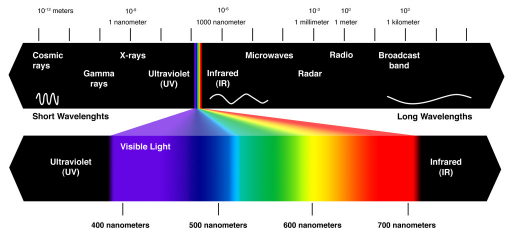 Infrared region spans from 700nm to 1400nm and is widely used in most of the IR sensors and fibre optics. The Mid infrared region spans from 1400nm to 300nm and is mainly used in heat sensing applications. The Far infrared region that spans from 3000nm to 1mm is majorly used in thermal imaging. These different regions are effectively used to build various applications like night vision devices, infrared astronomy, infrared missile tracking etc. </p>

### _Types of IR sensors_
<br/>
<p style='text-align: justify;'>There are various IR sensors available in the market. Based on their configuration, we can classify them as Active IR sensors and Passive IR sensors (PIR). Active IR sensors are those sensors capable of both producing and sensing IR signals while Passive IR sensors mainly consist of detectors. Most of the motion detectors make use of PIR. The PIR detects the IR signals caused due to the heat energy transmitted by any object. In this chapter we would focus on Active IR sensors.
</p>

### _Active IR Sensors_
<br/>
<p style='text-align: justify;'>An active IR sensor consists of both IR transmitter and IR receiver. The transmitter transmits the IR signals which would strike on an object and would bounce back to the receiver. However not all signals are bounced from the surface of the object. The bouncing of signals depends on the colour and material of the object. The dark colors have the ability to absorb more energy and transmit only a small portion of the received light. Light colors on the other hand reflect most of the received light signals. It is this change of deflection of light that gives us the perception for colors. Since IR sensors are only capable of detecting the presence/absence of IR signals, they are employed to detect bright/dark surfaces. An IR sensor is not capable of differentiating various colors.
</p>

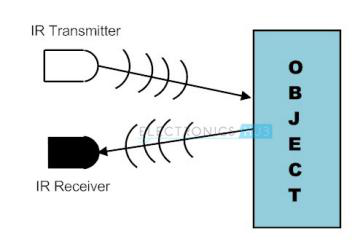

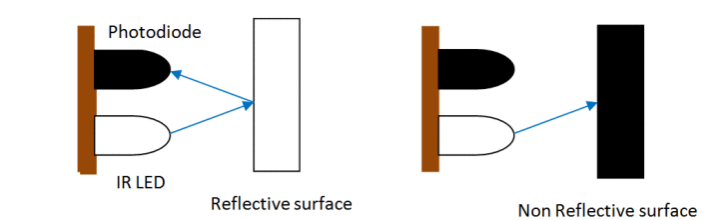

<br/><br/>

### _IR sensor boards_
<br/>
<p style='text-align: justify;'>Now let's talk about the component required for a complete Active IR sensor. An IR sensor has two major LEDs that do the purpose of transmission and detection of signals. A transmission LED looks just like a normal LED diode. Upon applying sufficient voltage across the terminals, the LED produces signals which are transmitted in a straight line. A receiver LED acts as a photo-diode that excites electrons upon receiving an IR signal. The receiver changes its resistance, which is used to detect the presence of IR signal. It is quite easy to identify both the LEDs. The IR receiver would be in dark color to prevent detection of surrounding IR signals. Note that the Sun emits a wide range of electro-magnetic radiation, so it is possible for an IR receiver to detect the IR signals from the sunlight. Although it appears just like two LEDs, we would require proper circuitry to get a calibrated reading. Keep in mind that the receiver and transmitter LED need not always be on the same board, they can have separate circuits to function properly.
</p>

<br/>

### _Detailing IR sensor FC-51_
<br/>
<p style='text-align: justify;'>There are various IR sensor boards available in the market. You may choose any IR sensors suitable for your application. However the underlying principle of IR sensor are the same. Here we would make use of IR sensor board FC-51 to interface with Arduino.
</p>
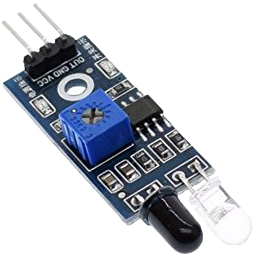
<br/>
<p style='text-align: justify;'>A typical IR sensor board consist of both the transmitter and receiver diodes along with supporting circuitry which includes a potentiometer, an IC and a couple of resistors and LEDs. The potentiometer is used to adjust the sensitivity of the board. The more sensitive the board is, greater will be the amplification of weak signal detected. In other words, 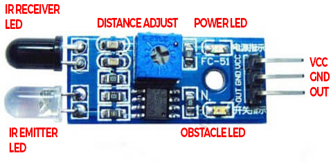  it would be able to detect IR signal from bit greater distance. The IC would amplify the change in the resistance of IR receiver LED and trigger corresponding voltage variations. We can also find two additional indicative LED on the board. One of the LED glows if the board is powered and the other LED glows when the board detects IR signals. 
</p>
<br/>
<p style='text-align: justify;'>Now let's talk about the pins on the board. FC-51 have three legs for interfacing with Arduino. Each legs have there associated marking on the board to indicate what that leg is used for. The VCC pin indicates the power in for the board. The 5v supply from the microcontroller is connected to the VCC and the ground (GND) of the board is connected to the GND pin of the microcontroller. The OUT pin of the board would act as the input for the Arduino. The OUT pin gives out 5V upon detecting a bright surface and 0V upon detecting a dark surface. There do exist inverted boards that just detects the opposite! So keep in mind to check board you have before you start coding. </p>
<br/>

<br/>
<p style='text-align: justify;'>
Usually in an digital circuit, voltage below 2.3v is regarded as a low signal ( 0v | binary zero) and those above 2.5v as high signal ( 5v | binary 1). There do exist IR sensor boards that provide analog output reading. Make sure to understand the configuration of the board before interfacing with Arduino. With that, let's start coding. Since FC-51 gives digital output ( HIGH | LOW ) we would be using an Arduino digital pin of Arduino to interface.
</p>

### Code example 1   
Objective : Program to print the status of IR sensor to Serial monitor    


```C
int IR_pin = 2;	    //connect OUT pin of IR sensor to 2nd pin of Arduino

void setup()
{
    pinMode(IR_pin,INPUT);		//IR_pin is to act as an input mode
    Serial.begin(9600);			//Baud rate that serial monitor listens to
}

void loop()
{
    int state = digitalRead(IR_pin);		//Reading the digital state of IR_pin
    if( state == HIGH){
    Serial.println("Bright surface detected");
}
else{
    Serial.println("Dark surface detected");
}
    delay(500);					//Slow down the code so that serial monitor
    // does not flood with characters
}

```

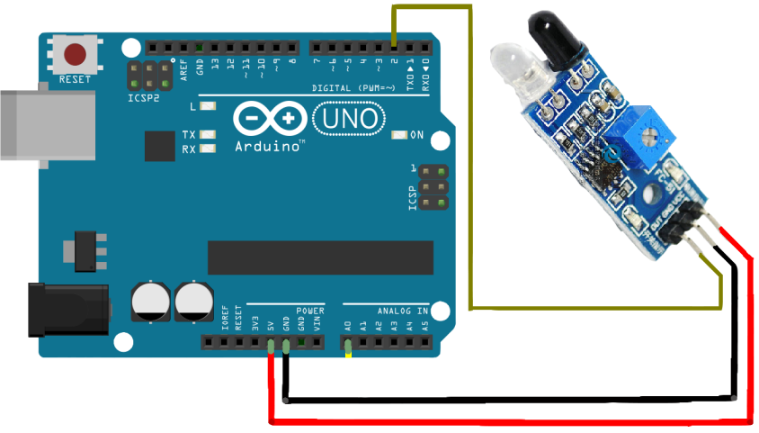

<p style='text-align: justify;'> Set the serial monitor at 9600 baud rate and see the results. We can find that when there is no object in front of sensor or in the presence of a dark object, the serial monitor shows "Dark surface detected". The monitor would show "Bright surface detected" when there is a white/reflective surface is introduced. Keep in mind that the sun light/flames also emit IR radiations that can be detected by IR sensors.</p>

### Code example 2
Objective: Program to turn on the inbuild LED at pin 13 of Arduino uno if IR sensor detects a while surface. Else keeps the LED off.
\
The circuit of previous example can be used.

<br/>

Code

```C
int IR_pin = 2;
int LED = 13;
void setup(){
pinMode(IR_pin,INPUT);
pinMode(LED,OUTPUT);
}
void loop(){
int state = digitalRead(IR_pin);
digitalWrite(LED, state);

//alternatively use the single line code
//digitalWrite(LED,digitalRead(IR_pin));

delay(200);
}

```

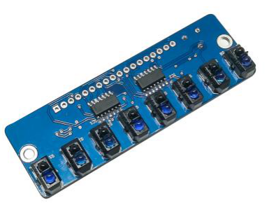
<p style='text-align: justify;'>Line follower bot is an simple bot that make use of IR sensors. The bot consist of IR sensors ( usually an IR sensor array ), wheel and motors, motor driver, Voltage source all placed in a chassis. An IR array is a collection of 4 to 6 IR sensor receivers and transmitters. We would be reading values from individual pairs of sensors. Another major component is the motor driver. As the name suggests, they are used to drive motors. Jump to the chapter "Motor Driver" to setup the bot - wheels and motors. Line follower bot follows a line to its destination. To detect the more precisely, the paths is formed by black lines in a white background or white path in black background. Usually the later is chosen as it is easy to construct black path in white background. For this simple bot, we would be making use of two IR sensors instead of an IR array. Our bot would have two wheels instead of four, although it is easy to extend to four wheels.
</p><br/>

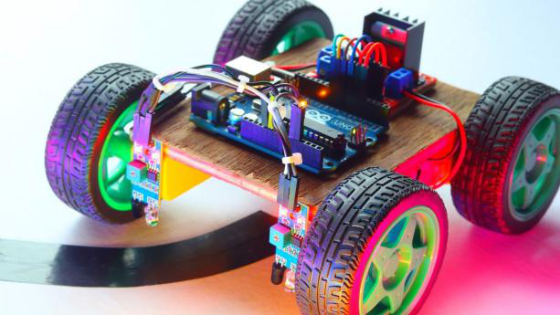
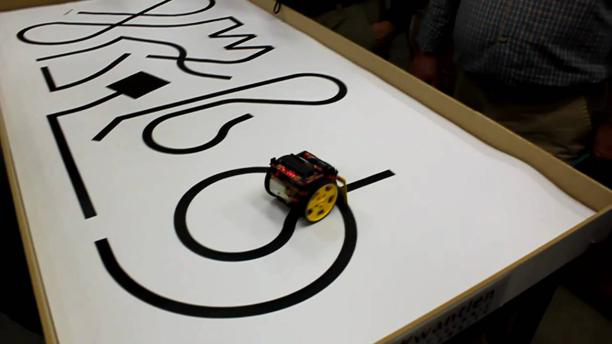

### _Tracing line - Line follower_

<p style='text-align: justify;'>The main event of the line follower is to trace the line. In our sample environment, we would be using two IR sensors to detect the black line on the while surface. The bot is placed such that the black line moves right through the center of the bot. Both the sensors are placed right next to the dark line. <br/>
Now let's discuss some of the possible combinations of signals we can receive.
</p>

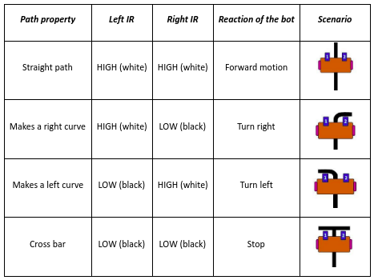

<p style='text-align: justify;'>Here we have listed all sorts of possible combinations with 2 IR sensors. Now let's implement them in our bot. Take a quick peek at the chapter "Motor Driver" where we have programmed a small bot. Lets add the additional IR sensors to them to complete our line follower.
</p>
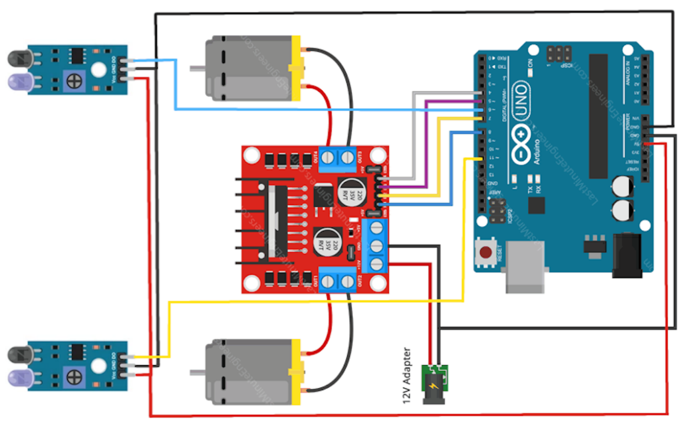
<p style='text-align: justify;'>Lets just detail the connections here. The VCC and GND of IR sensors are connected to 5V and GND of Arduino. The left IR sensor (bottom) gives its output to the 11th pin of Arduino while the right IR sensor (top) gives its output to the 6th pin of Arduino. The GND of the motor driver is connected to the GND of Arduino and input1, input2, input3, input4 of driver are connected to pins 8, 7, 5, 4 pins of Arduino respectively. Left motor is connected to channel A and the right motor is connected to channel B of the motor driver. Finally we powered the driver using a 12v adapter and connected the GND of driver and Arduino to it. Now let's implement the logic depicted on the above table.
</p>

### Code

``` C 

int m1 = 8, m2 = 7;  //left  motor pins
int m3 = 5, m4 = 4;  //right motor pins
int ir1 = 11, ir2 = 6; //left and right IR sensor inputs

void setup(){
//set motor pins as output for Arduino.
pinMode(m1,OUTPUT); pinMode(m2,OUTPUT);
pinMode(m3,OUTPUT); pinMode(m4,OUTPUT);

//set IR pins as input for Arduino
pinMode(ir1, INPUT); pinMode(ir2, INPUT);

Serial.begin(9600);
}

//A function to control motor movement
void turn_motor(int input1, int input2, char dir){
if( dir == ‘F’){
//clockwise rotation
digitalWrite(input1,HIGH);
digitalWrite(input2,LOW);
}
else if( dir == ‘S’){
//no rotation
digitalWrite(input1,LOW);
digitalWrite(input2,LOW);
}
}

void loop(){
//reading the IR sensors
int left  = digitalRead(ir1);
int right = digitalRead(ir2);

if( left == HIGH && right == HIGH){ 		//Forward motion
turn_motor(m1, m2, ’F’);  			//left  wheel : clockwise
turn_motor(m3, m4, ’F’);  			//right wheel : clockwise
Serial.println("Bot moving forward");
}
else if(left == HIGH && right == LOW){	//Right motion
turn_motor(m1, m2, ’F’);  			//left  wheel : clockwise
turn_motor(m3, m4, ’S’);  			//right wheel : stop
Serial.println("Bot turning right");
}
else if(left == LOW && right == HIGH){	//Left motion
turn_motor(m1, m2, ’S’);  			//left  wheel : stop
turn_motor(m3, m4, ’F’);  			//right wheel : clockwise
Serial.println("Bot turning left");
}
else{									//Stopping the bot
turn_motor(m1, m2, ’S’);  			//left  wheel : stop
turn_motor(m3, m4, ’S’);  			//right wheel : stop
Serial.println("Bot paused");
}
delay(100);
}

```

<p style='text-align: justify;'>You might have noticed that the bot drifts or becomes unstable when it changes its direction suddenly. This is because the wheels are rotating with higher speed than our bot can handle. The solution to such problems is to control the speed of the wheels. Refer the chapter "Motor Driver" to build speed controlled bot. You may also find that both travel in a zig-zag fashion, the curves are not covered smoothly or the bot may miss some sharp curves. To avoid such problems, line followers are built using an IR array, where there are more sensors to detect the intensity of curves etc. 
</p>
<p style='text-align: justify;'>Line follower is one of the popular projects in Arduino-ROBOTICS. Various competitions are held across the world with varying difficulty and challenges. Maze solver is one of the most common events held. Speed, accuracy and reliability of bots are noted to announce the winner. To improve the probability of bagging the price, various statistical theories, mathematical models are applied and coded into the programs. Here we have detailed the basics of line followers. The rest is left to you to explore!
</p>

<br>

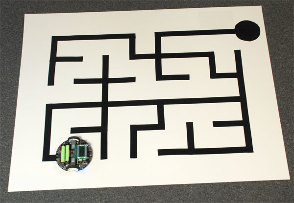
